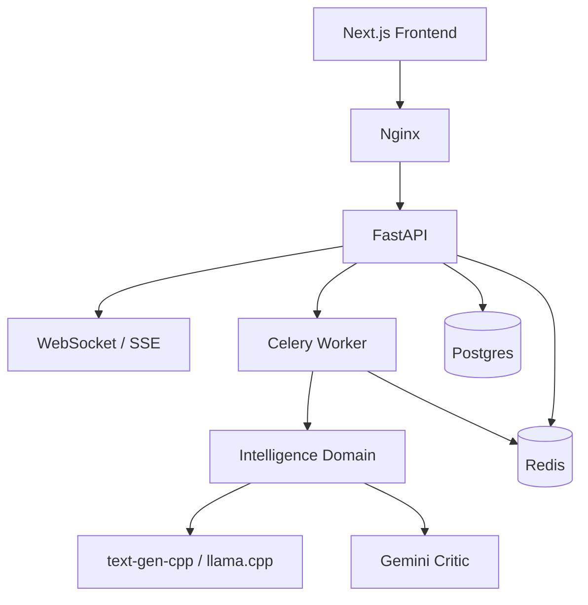

# YC-Style Product Development Plan

## Purpose

This document translates the repository's current product thesis into an execution-oriented plan for the next 12 months. It is written for founders, operators, and contributors who need a practical path from prototype to credible pilot.

The plan assumes the current repository baseline:

- A **Next.js** frontend and **FastAPI** backend already exist.
- The platform uses **Redis**, **Celery**, and **Postgres** for async workflows and persistence.
- The default local inference runtime is **`text-gen-cpp` + `lfm-thinking`**.
- The product wedge is **commodities-focused intelligence with a dedicated Critic verification layer**.

## Executive framing

The strongest version of Alpha Insights is **not** a general-purpose AI terminal. It is a narrow institutional workflow that helps commodities-focused risk and trading teams move from noisy narrative inputs to an **audited decision artifact**.

The repository already supports that positioning:

- The README defines the product as an institutional research environment for prediction markets and physical commodities trading.
- The vision document frames the product around hedge-fund workflows and the "Intelligence Mirror" wedge.
- The current stack already includes async orchestration, a Critic pattern, and local inference deployment.

The YC-style interpretation is straightforward:

1. Pick the smallest painful workflow.
2. Make it work end-to-end for a real user.
3. Measure usefulness and truth, not just activity.
4. Expand only after pilots pull the product forward.

## Current repository baseline

### What already exists

The repository is meaningfully ahead of a blank-slate MVP:

- Product and strategy artifacts already exist in `vision.md`, `BACKLOG.md`, and `docs/PRODUCT_FRAMEWORK.md`.
- The compose stack includes frontend, backend, worker, Redis, Postgres, Nginx, and the local inference service.
- The backend exposes prediction, mirror, chat, trade, and support routes through a single FastAPI application.
- The Critic pattern and local model path are both already first-class concepts in the repo narrative.

### What is still prototype-grade

Several code and workflow gaps will block institutional pilots if they remain unresolved:

1. **Prediction route mismatch**
   - The frontend helper currently calls `/api/predict` and `/api/task/{id}`.
   - The backend exposes those endpoints under the `/prediction` router prefix.
   - This creates a real integration break unless compatibility routing is added.

2. **Inference runtime drift in mirror analysis**
   - The shared AI client already treats `llama-cpp` as the default provider and reads `LLAMA_CPP_HOST`.
   - The mirror application service still directly reads `OLLAMA_HOST` and posts to `/completion` itself.
   - That drift makes the runtime story harder to reason about and harder to operate.

3. **Demo-grade authentication defaults**
   - The current auth path returns a default admin-like user when no token or API key is supplied.
   - This is acceptable for local demos, but it is not acceptable for institutional pilots.

4. **Observability still needs hardening**
   - Basic structured logging exists in `backend/app/main.py`.
   - The backlog still correctly tracks structured telemetry as a high-priority platform need.

## Product definition

### Product statement

**Alpha Insights** is a commodities intelligence workspace that converts fragmented narrative, market, and competitive signals into **audited, decision-grade forecasts** for hedge-fund risk and trading teams.

The winning workflow is:

**signal -> sources -> forecast -> critic review -> archived decision memo**

That workflow matters more than generic chat, generic dashboards, or broad multi-asset coverage.

### Initial ideal customer profile

The initial beachhead should remain narrow:

- Hedge funds with a commodities sleeve.
- Commodity-focused pods inside broader multi-strategy firms.
- Risk leaders and PMs who care about provenance, speed, and internal decision review.

### Core personas

| Persona | Job to be done | Pain today | MVP value |
| --- | --- | --- | --- |
| Head of Risk | Reduce narrative-driven mistakes and audit decisions | Inputs are noisy, hard to verify, and poorly archived | Critic-reviewed decision memos with provenance |
| Commodity PM / Trader | Form and revise a view quickly | Synthesis is slow and confidence is uneven | Faster, structured, high-conviction briefs |
| Quant Researcher | Evaluate forecast quality over time | LLM outputs are hard to benchmark | Brier-score tracking and outcome logging |
| Ops / Security Lead | Approve tool usage safely | Weak auth and missing auditability create risk | Minimum viable controls, logs, and role separation |

## Value proposition and positioning

The product should be positioned as an **audit layer for commodity intelligence workflows**, not as a new terminal.

### Why buyers may care

- **Decision velocity**: compresses multi-source synthesis into a reusable output.
- **Decision integrity**: adds a dedicated Critic step rather than trusting a single model pass.
- **Deployment pragmatism**: already supports a local inference path by default.

### Competitive stance

Against terminal incumbents and AI research platforms, Alpha Insights should win on:

- domain focus,
- auditability,
- local/private deployment posture,
- and the explicit "forecast plus critique" workflow.

It should not try to win on breadth of market data coverage in the near term.

## MVP definition

The MVP should be defined as **one narrow audited workflow** that a pilot customer could use in production-adjacent research.

### In scope

- A user selects or enters a commodity theme.
- The system gathers a small set of sources.
- The system generates a probabilistic forecast.
- The Critic reviews the output and highlights weaknesses.
- The run is stored and exportable as a decision memo.

### Out of scope

- Full-scale competitor scraping coverage.
- Full trade execution automation.
- Broad enterprise platform packaging.
- Polished multi-team collaboration features.

## Stabilization priorities before pilots

These should happen before trying to sell the product as more than a founder-led prototype.

### 1. Fix API contracts

Choose one of the following:

- Update the frontend helpers to use `/api/prediction/predict` and `/api/prediction/task/{id}`, or
- add compatibility routes in the backend.

The key point is to make the public contract unambiguous.

### 2. Unify inference access

The mirror workflow should move onto the shared AI abstraction so that:

- provider selection is centralized,
- `LLAMA_CPP_HOST` remains the default local runtime,
- retry and fallback behavior are consistent,
- and the repo's documented runtime matches actual code paths.

### 3. Replace demo auth behavior

Before a real pilot:

- remove the no-credentials default admin path,
- require at least API-key or token authentication,
- add per-user audit logging for exports and sensitive actions,
- and support basic analyst/admin role separation.

### 4. Instrument end-to-end runs

Every analysis should record:

- request ID,
- user ID,
- run ID / task ID,
- phase timings,
- model/provider used,
- Critic outcome,
- and export or share events.

## Metrics plan

A YC-style execution loop needs both **growth metrics** and **truth metrics**.

### AARRR for enterprise pilots

| Stage | KPI | Working definition |
| --- | --- | --- |
| Acquisition | Qualified pilot leads | Active conversations with risk or trading decision-makers |
| Activation | First audited run | First completed forecast plus Critic output within 7 days |
| Retention | Weekly active analysts | Distinct users producing 2+ useful runs per week |
| Referral | Internal expansion | Additional users added inside the same firm |
| Revenue | Pilot conversion | Paid pilot or annual conversion after evaluation |

### Product quality metrics

Because the product makes forecast-like outputs, usage alone is insufficient.

Track:

- **Brier score** by event category.
- **Critic pass rate** and override rate.
- **Time to first useful brief**.
- **Run completion rate**.
- **Percent of runs with acceptable citation coverage**.

### Event model

Minimum canonical events:

- `analysis_requested`
- `analysis_started`
- `analysis_completed`
- `analysis_failed`
- `critic_completed`
- `critic_overruled`
- `export_created`
- `share_link_created`

## Recommended architecture target

This preserves the current stack but makes one architectural priority explicit: **all intelligence-facing model calls should converge behind a shared abstraction**.

## Twelve-month roadmap

### Q2 2026: Stabilize and make pilotable

Primary outcome: a real user can complete the audited workflow without hitting avoidable demo breakage.

Key work:

- fix route mismatches,
- align mirror inference with shared runtime handling,
- formalize run storage and export,
- improve telemetry,
- run 5-10 structured user interviews.

Success criteria:

- 3 pilot users can generate a useful brief in under 10 minutes,
- activation within 7 days exceeds 60%,
- end-to-end run success rate is above 90% in pilot usage.

### Q3 2026: Add data credibility and evaluation

Primary outcome: outputs become more measurable and more defensible.

Key work:

- add one or two credible physical-data or customer-provided inputs,
- ship a simple evaluation harness,
- begin weekly Brier-score review,
- refine brief templates based on pilot usage.

Success criteria:

- weekly active usage is sustained in pilot accounts,
- outcome tracking exists for at least one forecast category,
- quality metrics improve against a baseline workflow.

### Q4 2026: Convert pilots and expand usage

Primary outcome: move from interesting pilot to budgeted workflow.

Key work:

- decision memo collaboration and exports,
- seat expansion support,
- pricing and pilot packaging experiments,
- provenance policies and source controls.

Success criteria:

- at least one paid conversion,
- at least one account shows internal expansion,
- decision memos become a repeat artifact in weekly workflows.

### Q1 2027: Reliability and compliance baseline

Primary outcome: the platform becomes operationally credible for more demanding buyers.

Key work:

- harden auth and auditing,
- add monitoring and failure analysis,
- improve model fallback behavior,
- document deployment and data-handling policy.

Success criteria:

- failed-run rate stays below 1-2%,
- all sensitive actions are auditable,
- runtime fallback behavior is observable and testable.

## Growth and go-to-market

The right early GTM motion is **founder-led, pilot-driven, and highly manual**.

### Recommended motion

- Target small commodity-focused teams where workflow change can happen quickly.
- Offer short audited-intelligence pilots with explicit success criteria.
- Turn each pilot run into a reusable decision memo artifact.
- Use internal expansions as the first strong retention/referral signal.

### Near-term experiments

| Experiment | Hypothesis | Cost | Signal |
| --- | --- | --- | --- |
| Concierge pilot support | High-touch feedback will sharpen the workflow fastest | Founder time | Faster activation and clearer user pull |
| Commodity narrative audit newsletter | Demonstrating the workflow creates warm interest | Low cash, medium time | Replies, intros, pilot requests |
| Targeted outreach to risk and PM roles | A narrow wedge message will outperform a broad AI pitch | Low cash | Meeting conversion rate |
| Pilot pricing tests | Enterprise willingness to pay needs early validation | Medium founder time | Pilot-to-paid conversion |

## First 90 days checklist

### Operating cadence

- Set one north-star metric: **audited briefs produced weekly by real users**.
- Spend time every week on shipping, user learning, and reliability.
- Keep a written list of major assumptions and mark them validated or unvalidated.

### Product and user discovery

- Run 15-25 user conversations focused on specific recent workflows.
- Standardize a single output template for the first decision memo.
- Iterate on the memo until users say they would actually circulate it internally.

### Engineering

- Fix the prediction routing mismatch.
- Move mirror LLM access behind the shared AI client.
- Add structured run-level telemetry.
- Add an internal admin view for runs, failures, and feedback.

### Data and evaluation

- Define what counts as ground truth for each forecast category.
- Store forecast timestamps and outcomes.
- Start with one reliable data connector before expanding coverage.

### Security baseline

- Remove the default-admin demo path in non-local contexts.
- Require credentials for pilot environments.
- Audit exports, trade payload generation, and role-sensitive actions.
- Document data handling in plain language.

### Sales and customer success

- Use a short pilot template with explicit deliverables.
- Hold kickoff, midpoint, and closeout sessions for every pilot.
- Capture keep / kill / change decisions at the end of each pilot.

## Decision summary

The repository already encodes a credible thesis: **commodities-focused intelligence with an explicit Critic layer**. The next step is not expanding surface area. The next step is making one workflow reliable enough that a real fund team can use it repeatedly.

That is the YC-style path for this repo:

- narrow the wedge,
- stabilize the stack,
- measure truth and usefulness,
- and let pilots pull the roadmap forward.
